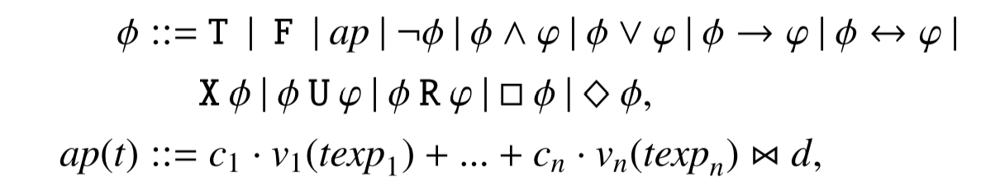

# Notes & Tips

## 3-SAT

3-SAT 一般写成 CNF，因为 DNF 的 SAT 是 trivial 的（直接过一遍其中的某个 conjunction 就可以知道 satisfiable）。但是 CNF -> DNF 需要指数时间和 space。

## LTL vs SAT vs SMT

* LTLC: Linear Temporal Logic for Control，用 Horizon 限制深度后可以转线性规划，因为没有逻辑变量(literal). （但是 LTLC 转 Buchi Automaton 是指数复杂度的？）

* SAT: 有 boolean literal，导致指数复杂度
* SMT：比起 SAT 加入了更多谓词，更加复杂